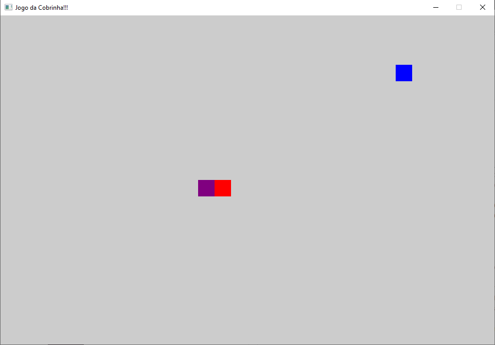

# JOGO DA COBRINHA
 Jogo feito na disciplina TECVII- Universidade federal de Pelotas 
Baseado no exemplo encontrado na biblioteca ggezÇhttps://github.com/ggez/ggez

REFERENCIAS 
https://rust-br.github.i

https://github.com/ggez/ggez/blob/master/examples/04_snake.rs

https://github.com/deckarep/flappy-rust

https://www.youtube.com/watch?v=DnT_7M7L7vo&t=464s

https://www.youtube.com/watch?v=iR7Q_6quwSI&t=2172s

https://www.youtube.com/watch?v=AYfehnFklkA

https://www.youtube.com/watch?v=8DUENLiOfiQ&t=1868s

Não esquecer de usar a biblioteza GGEZ [ggez](https://crates.io/crates/ggez)

## Requer
1. Precisa instalar o RUST [installed](https://www.rust-lang.org/en-US/install.html)
2.iNSTALE EM SEU CARGO.TOML [SDL2 libraries](https://github.com/Rust-SDL2/rust-sdl2#requirements)

### Use cargo run no dicionário do projeto para rodar o jogo

````
```

//fn main() -> GameResult {
    // Primeiro, criamos uma estrutura `ggez::Conf` que define as configurações do nosso jogo.
    let (ctx, event_loop) = ggez::ContextBuilder::new("Jogo da Cobrinha-=TECVII", "welder")
        // Primeiro, criamos uma estrutura `ggez::Conf` que define as configurações do nosso jogo.
        .window_setup(ggez::conf::WindowSetup::default().title("Jogo da Cobrinha!!!"))
       // Em seguida, chamamos a função `ggez::ContextBuilder::new` para criar um `ContextBuilder`,
    // que nos permitirá personalizar como queremos que o contexto seja criado.
        .window_mode(
            ggez::conf::WindowMode::default()
                .dimensions(SCREEN_SIZE.0 as f32, SCREEN_SIZE.1 as f32),
        )
        
        // CASO DE ERRADO, VAI DAR RUIM!!!!!!
        .build()
        .expect("DEU RUIM!!!!!!");
   // Em seguida, criamos uma instância do nosso `GameState` e a passamos para a função
    // `ggez::event::run` para iniciar o loop principal do jogo.
    let state = GameState::new()?;
   
    event::run(ctx, event_loop, state)
}


```
````

````
```
// Primeiro, importaremos as crates de que precisamos para o nosso jogo;
// neste caso, apenas ggez e rand.
// Em seguida, precisamos realmente "usar" as partes do ggez que iremos
// precisar com frequência.
use ggez::event::KeyCode;
use ggez::{event, graphics, Context, GameResult};

// Vamos trazer algumas coisas do std para nos ajudar no futuro.
use std::collections::LinkedList;
use std::time::{Duration, Instant};

// E, finalmente, trazemos a trait Rng para o escopo para que possamos gerar
// alguns números aleatórios mais tarde.
use rand::Rng;

// de inicio devo fazer é configurar algumas constantes .

// Aqui defini o tamanho  tabuleiro de jogo em termos de quantas células da grade ele ocupará.
//opetei fazer um tabuleiro de 30 x 20.
const GRID_SIZE: (i16, i16) = (30, 20);
// Agora definimos o tamanho em pixels de cada célula, que será de 32x32 pixels.
const GRID_CELL_SIZE: (i16, i16) = (32, 32);

// Em seguida,aqui o  quão grande queremos que nossa janela seja, multiplicando
// os componentes do nosso tamanho de grade pelo tamanho de pixel correspondente.

const SCREEN_SIZE: (u32, u32) = (
    GRID_SIZE.0 as u32 * GRID_CELL_SIZE.0 as u32,
    GRID_SIZE.1 as u32 * GRID_CELL_SIZE.1 as u32,
);

// Quatidade das    vezes queremos que nosso jogo seja atualizado por segundo.
// para que nossa cobra não se mova muito rápido na tela
// porque está se movendo uma célula inteira a cada quadro.
const UPDATES_PER_SECOND: f32 = 8.0;
// E obtemos os milissegundos de atraso correspondentes a essa taxa de atualização.
const MILLIS_PER_UPDATE: u64 = (1.0 / UPDATES_PER_SECOND * 1000.0) as u64;

// Estrutura que conterá a posição de uma entidade em nosso tabuleiro de jogo
// ou grade  acima. Usamos inteiros com sinal porque queremos armazenar apenas números inteiros,
// e precisamos que sejam com sinal para que funcionem corretamente com nossa aritmética de módulo posteriormente.

#[derive(Clone, Copy, PartialEq, Eq, Debug)]
struct GridPosition {
    x: i16,
    y: i16,
}


// Esta é uma trait que fornece uma função de módulo que funciona para valores negativos
// em oposição ao operador de resto padrão (%) que não o faz. Vamos usá-lo
// para fazer com que nossa cobra se mova de um lado do tabuleiro para o outro
// quando sair da parte superior, inferior, esquerda ou direita da tela.
trait ModuloSigned {
    fn modulo(&self, n: Self) -> Self;
}

// Aqui implementamos a trait `ModuloAssinado` para qualquer tipo T que implemente
// `Add` (o operador `+`) com um tipo de saída T e Rem (o operador `%`)
// que também tem um tipo de saída T, e que pode ser clonado. Estas são as limitações
// de que precisamos para implementar uma função de módulo que funcione para números negativos.
impl<T> ModuloSigned for T
where
    T: std::ops::Add<Output = T> + std::ops::Rem<Output = T> + Clone,
{
    fn modulo(&self, n: T) -> T {
       // Devido às nossas limitações de trait, agora podemos aplicar esses operadores.
        (self.clone() % n.clone() + n.clone()) % n
    }
}

impl GridPosition {
    // Criamos uma função auxiliar padrão para que possamos criar uma nova `PosicaoGrade`
    // mais facilmente.
    pub fn new(x: i16, y: i16) -> Self {
        GridPosition { x, y }
    }

    // Assim como uma função auxiliar que nos dará uma `PosicaoGrade` aleatória de
    // `(0, 0)` a `(max_x, max_y)`
    pub fn random(max_x: i16, max_y: i16) -> Self {
        let mut rng = rand::thread_rng();
        // Podemos usar `.into()` para converter de `(i16, i16)` para uma `PosicaoGrade` já que
        // implementamos `From<(i16, i16)>` para `PosicaoGrade` abaixo.
        (rng.gen_range(0..max_x), rng.gen_range(0..max_y)).into()
    }

    // Faremos outra função auxiliar que leva uma posição de grade e retorna uma nova após
    // fazer um movimento na direção de `dir`. Usamos nossa trait `ModuloAssinado` acima,
    // que agora está implementada em `i16` porque ela atende aos requisitos da trait,
    // para fazer o movimento automaticamente se deslocar dentro do nosso tamanho de grade
    // se o movimento tivesse de outra forma nos movido para fora do tabuleiro para o topo,
    // parte inferior, esquerda ou direita.
    pub fn new_from_move(pos: GridPosition, dir: Direction) -> Self {
        match dir {
            Direction::Up => GridPosition::new(pos.x, (pos.y - 1).modulo(GRID_SIZE.1)),
            Direction::Down => GridPosition::new(pos.x, (pos.y + 1).modulo(GRID_SIZE.1)),
            Direction::Left => GridPosition::new((pos.x - 1).modulo(GRID_SIZE.0), pos.y),
            Direction::Right => GridPosition::new((pos.x + 1).modulo(GRID_SIZE.0), pos.y),
        }
    }
}

// Implementamos a trait `From` aqui, que neste caso nos permite converter facilmente entre
// uma `PosicaoGrade` e um `ggez` `graphics::Rect` que preenche aquela célula da grade.
// Agora podemos simplesmente chamar `.into()` em uma `PosicaoGrade` quando queremos um
// `Rect` que represente aquela célula da grade.
impl From<GridPosition> for graphics::Rect {
    fn from(pos: GridPosition) -> Self {
        graphics::Rect::new_i32(
            pos.x as i32 * GRID_CELL_SIZE.0 as i32,
            pos.y as i32 * GRID_CELL_SIZE.1 as i32,
            GRID_CELL_SIZE.0 as i32,
            GRID_CELL_SIZE.1 as i32,
        )
    }
}

// E aqui implementamos `From` novamente para nos permitir converter facilmente entre
// `(i16, i16)` e uma `PosicaoGrade`.
impl From<(i16, i16)> for GridPosition {
    fn from(pos: (i16, i16)) -> Self {
        GridPosition { x: pos.0, y: pos.1 }
    }
}

// Em seguida, criamos uma enumeração que representará todas as direções possíveis
// que nossa cobra pode se mover.
#[derive(Clone, Copy, Debug, PartialEq, Eq)]
enum Direction {
    Up,
    Down,
    Left,
    Right,
}

impl Direction {
     // Criamos uma função auxiliar que nos permitirá obter facilmente o inverso
    // de uma `Direcao`, que podemos usar posteriormente para verificar se o jogador deve
    // ser capaz de mover a cobra em uma determinada direção.
    pub fn inverse(&self) -> Self {
        match *self {
            Direction::Up => Direction::Down,
            Direction::Down => Direction::Up,
            Direction::Left => Direction::Right,
            Direction::Right => Direction::Left,
        }
    }

    // Também criamos uma função auxiliar que nos permitirá converter entre um
    // `ggez` `KeyCode` e a `Direcao` que ela representa. Claro,
    // nem todo keycode representa uma direção, então retornamos `None` se esse
    // for o caso.
    pub fn from_keycode(key: KeyCode) -> Option<Direction> {
        match key {
            KeyCode::Up => Some(Direction::Up),
            KeyCode::Down => Some(Direction::Down),
            KeyCode::Left => Some(Direction::Left),
            KeyCode::Right => Some(Direction::Right),
            _ => None,
        }
    }
}

// Esta é principalmente uma abstração semântica sobre uma `PosicaoGrade` para representar
// um segmento da cobra. Pode ser útil, por exemplo, ter cada segmento conter sua própria
// cor ou algo semelhante. Este é um exercício deixado ao leitor ;)
#[derive(Clone, Copy, Debug)]
struct Segment {
    pos: GridPosition,
}

impl Segment {
    pub fn new(pos: GridPosition) -> Self {
        Segment { pos }
    }
}

// Esta é novamente uma abstração sobre uma `PosicaoGrade` que representa
// uma peça de comida que a cobra pode comer. Ela pode se desenhar.
struct Food {
    pos: GridPosition,
}

impl Food {
    pub fn new(pos: GridPosition) -> Self {
        Food { pos }
    }

   // Aqui é a primeira vez que vemos como o desenho funciona com ggez.
    // Temos uma função que recebe uma referência a um `mut ggez::Context`, que usamos
    // com as funções auxiliares em `ggez::graphics` para desenhar. Também retornamos um
    // `ggez::GameResult` para que possamos usar o operador `?` para propagar falhas.
    fn draw(&self, ctx: &mut Context) -> GameResult {
        //Primeiro, precisamos criar um MeshBuilder
        let mesh = graphics::MeshBuilder::new()
             // Chamamos rectangle para criar um quadrado
            .rectangle(
                // Em seguida, desenhamos um retângulo com o modo de desenho Fill, e convertemos o
                graphics::DrawMode::fill(),
             // desde que implementamos `From<PosicaoGrade>` para `Rect` anteriormente.
                // A posição da Comida em um `ggez::Rect` usando `.into()`, que podemos fazer
                self.pos.into(),
                  // Por fim, definimos a cor para desenhar, neste caso, toda comida será
                // colorida de azul.
                graphics::Color::new(0.0, 0.0, 1.0, 1.0),
            )?
            .build(ctx)?;

        graphics::draw(ctx, &mesh, graphics::DrawParam::default())?;
        Ok(())
    }
}


// Aqui definimos uma enumeração dos possíveis elementos que a cobra pode ter "comido"
// durante uma atualização do jogo. Ela pode ter comido um pedaço de `Comida`, ou
// ela pode ter comido `ElaMesma` se a cabeça colidir com seu corpo.
#[derive(Clone, Copy, Debug)]
enum Ate {
    Itself,
    Food,
}

/// Agora fazemos uma struct que contém todas as informações necessárias para descrever o
// estado da própria Cobra.
struct Snake {
   // Primeiro, temos a cabeça da cobra, que é um único `Segmento`.
    head: Segment,
    // Em seguida, temos a direção atual da cobra. Esta é
    // a direção em que a cobra se moverá quando `update` for chamado.
    dir: Direction,
    // Depois temos o corpo, que escolhemos representar como uma `LinkedList`
    // de `Segmento`s.
    body: LinkedList<Segment>,
    // Agora temos uma propriedade que representa o resultado da última atualização
    // que foi executada. A cobra pode não ter comido nada (None), Comida (Some(Comeu::Comida)),
    // ou ElaMesma (Some(Comeu::ElaMesma))
    ate: Option<Ate>,
    // Finalmente, armazenamos a direção em que a cobra estava se movendo da última
    // vez que `update` foi chamado, que usaremos para determinar as direções válidas
    // em que ela pode se mover na próxima vez que `update` for chamado.
    last_update_dir: Direction,
}

impl Snake {
    pub fn new(pos: GridPosition) -> Self {
        let mut body = LinkedList::new();
        // Nossa cobra inicialmente terá uma cabeça e um segmento de corpo,
        // e estará se movendo para a direita.
        body.push_back(Segment::new((pos.x - 1, pos.y).into()));
        Snake {
            head: Segment::new(pos),
            dir: Direction::Right,
            last_update_dir: Direction::Right,
            body,
            ate: None,
        }
    }

// Uma função auxiliar que determina se
    // a cobra come uma dada peça de comida com base
    // em sua posição atual.
    fn eats(&self, food: &Food) -> bool {
        self.head.pos == food.pos
    }
  // Uma função auxiliar que determina se
    // a cobra se come com base em sua posição atual
    fn eats_self(&self) -> bool {
        for seg in self.body.iter() {
            if self.head.pos == seg.pos {
                return true;
            }
        }
        false
    }

    // A principal função de atualização de nossa cobra, que é chamada toda vez
    // que queremos atualizar o estado do jogo.
    fn update(&mut self, food: &Food) {
       // Primeiro, obtemos uma nova posição da cabeça, usando nossa função auxiliar `nova_posicao`
        // a partir da direção atual da cobra.
        let new_head_pos = GridPosition::new_from_move(self.head.pos, self.dir);
      // Em seguida, criamos um novo segmento que será a nova cabeça usando a
        // nova posição que acabamos de criar.
        let new_head = Segment::new(new_head_pos);
        // Depois, colocamos o atual segmento da cabeça no início de nosso corpo
        self.body.push_front(self.head);
// E finalmente fazemos a nossa cabeça real ser o novo segmento que criamos.
        self.head = new_head;
           // Em seguida, verificamos se a cobra comeu algo enquanto se atualizava e, se o fez,
        // definimos nossa propriedade `comeu` para refletir esse estado.
        if self.eats_self() {
            self.ate = Some(Ate::Itself);
        } else if self.eats(food) {
            self.ate = Some(Ate::Food);
        } else {
            self.ate = None
        }
        // Se não comeu nada nesta rodada, removemos o último segmento do nosso corpo,
        // dando a ilusão de que a cobra está se movendo. Na realidade, todos os segmentos
        // permanecem parados, apenas adicionamos um segmento na frente e removemos um
        // na parte de trás. Se comermos uma peça de comida, deixamos o último segmento
        // para que possamos aumentar nosso corpo em um.
        if self.ate.is_none() {
            self.body.pop_back();
        }
// E definimos nossa última direção de atualização como a direção em que acabamos
        // de nos mover.
        self.last_update_dir = self.dir;
    }

       // Aqui, a cobra se desenha. Isso é muito semelhante ao desenho da Comida
    // que vimos anteriormente.
    fn draw(&self, ctx: &mut Context) -> GameResult {
         // Primeiro, iteramos pelos segmentos do corpo e os desenhamos.
        for seg in self.body.iter() {
            // Primeiro, criamos um novo MeshBuilder
            let mesh = graphics::MeshBuilder::new()
                // Since we want a square we call rectangle method
                .rectangle(
                     // Como queremos um quadrado, chamamos o método rectangle
                    graphics::DrawMode::fill(),
                     // Em seguida, configuramos o modo de desenho para preencher o retângulo
                    seg.pos.into(),
                   // Novamente, configuramos a cor (neste caso, todos os segmentos da cobra serão
                    // coloridos de roxo).
                    graphics::Color::new(0.5, 0.0, 0.5, 1.0) // Vermelho: 0.5, Verde: 0.0, Azul: 0.5, Alpha: 1.0
                    ,
                )?
                .build(ctx)?;
            graphics::draw(ctx, &mesh, graphics::DrawParam::default())?;
        }
        // E então fazemos o mesmo para a cabeça, tornando-a totalmente vermelha para distingui-la.
        let mesh = graphics::MeshBuilder::new()
            .rectangle(
                graphics::DrawMode::fill(),
                self.head.pos.into(),
                graphics::Color::new(1.0, 0.0, 0.0, 1.0),
            )?
            .build(ctx)?;

        graphics::draw(ctx, &mesh, graphics::DrawParam::default())?;
        Ok(())
    }
}

// Agora temos o coração do nosso jogo, o GameState. Esta struct
// implementará a trait `EventHandler` do ggez e, portanto, irá controlar
// tudo o que acontece no nosso jogo.
struct GameState {
    // Primeiro, precisamos de uma Cobra
    snake: Snake,
     // Uma peça de Comida
    food: Food,
       // Se o jogo acabou ou não
    gameover: bool,
   // E rastreamos a última vez que atualizamos para limitar
    // nossa taxa de atualização.
    last_update: Instant,
}

impl GameState {
     // Nossa função new configurará o estado inicial do nosso jogo.
    pub fn new() -> GameResult<Self> {
        // Primeiro, colocamos nossa cobra a um quarto do caminho na largura da grade
        // e no meio da altura da grade. Isso funciona bem, já que começamos movendo para a direita.
        let snake_pos = (GRID_SIZE.0 / 4, GRID_SIZE.1 / 2).into();
// Em seguida, escolhemos uma posição aleatória para colocar nossa peça de comida usando a função auxiliar que fizemos anteriormente.

        let food_pos = GridPosition::random(GRID_SIZE.0, GRID_SIZE.1);

        Ok(GameState {
            snake: Snake::new(snake_pos),
            food: Food::new(food_pos),
            gameover: false,
            last_update: Instant::now(),
        })
    }
}

// Agora implementamos EventHandler para GameState. Isso nos permitirá
// controlar o que acontece em nosso jogo em resposta a eventos como atualizações
// de quadros ou entradas do usuário.
impl event::EventHandler<ggez::GameError> for GameState {
    // Aqui implementamos o tratamento de atualização de quadros. Isso é chamado
    // uma vez a cada quadro (geralmente cerca de 60 vezes por segundo, mas podemos
    // definir nossa própria taxa de atualização se quisermos).
    fn update(&mut self, _ctx: &mut Context) -> GameResult {
        // Primeiro, verificamos quanto tempo se passou desde a última atualização.
        // Isso nos permite controlar a taxa de atualização do nosso jogo.
        if Instant::now() - self.last_update >= Duration::from_millis(MILLIS_PER_UPDATE) {
           // Se tempo suficiente passou, atualizamos o jogo.
            // Começamos verificando se o jogo já acabou. Se sim, não fazemos nada.
            if !self.gameover {
                // Em seguida, chamamos a função `atualizar` da cobra para mover a cobra
            // e verificar se ela comeu algo.
                self.snake.update(&self.food);
                // Em seguida, verificamos o que a cobra comeu.

                if let Some(ate) = self.snake.ate {
                    // Se ela comeu comida, geramos uma nova posição aleatória para a comida
                    // e a movemos para lá.
                    match ate {
                        // If it ate a piece of food, we randomly select a new position for our piece of food
                   
                        Ate::Food => {
                            let new_food_pos = GridPosition::random(GRID_SIZE.0, GRID_SIZE.1);
                            self.food.pos = new_food_pos;
                        }
                        // Se a cobra se comeu, o jogo acabou.
                        Ate::Itself => {
                            self.gameover = true;
                        }
                    }
                }
            }
           
            self.last_update = Instant::now();
        }
        // Atualizamos o horário da última atualização para o momento atual.
        Ok(())
    }

    
    // Aqui implementamos a função para desenhar o quadro do jogo. Isso é chamado
    // uma vez a cada quadro após o `update`.
    fn draw(&mut self, ctx: &mut Context) -> GameResult {
         // Primeiro, limpamos o contexto de desenho para que possamos
        // desenhar coisas novas neste quadro.
        graphics::clear(ctx, [0.8, 0.8, 0.8, 1.0].into());
       // Em seguida, chamamos as funções `desenhar` da cobra e da comida para desenhá-las.
        self.snake.draw(ctx)?;
        self.food.draw(ctx)?;
             // Finalmente, atualizamos o contexto de desenho para exibir o que desenhamos.
        graphics::present(ctx)?;
       // Aqui implementamos a função que lida com as entradas do usuário.
        ggez::timer::yield_now();
// Finalmente, atualizamos o contexto de desenho para exibir o que desenhamos.
        Ok(())
    }

    // Aqui implementamos a função que lida com as entradas do usuário.
    fn key_down_event(
        &mut self,
        _ctx: &mut Context,
        keycode: KeyCode,
        _keymod: ggez::input::keyboard::KeyMods,
        _repeat: bool,
    ) {
        // Verificamos se a tecla pressionada foi repetida. Se sim, não fazemos nada.
        if let Some(dir) = Direction::from_keycode(keycode) {
            // Verificamos se a nova direção é oposta à última direção em que a cobra se moveu.
            // Se for, não permitimos que a cobra se mova diretamente de volta para onde estava,
            // pois isso causaria uma colisão com ela mesma.
            if dir.inverse() != self.snake.last_update_dir {
                
// E finalmente, nossa função principal que inicializa o jogo e o executa.
                self.snake.dir = dir;
            }
        }
    }
}

fn main() -> GameResult {
    // Primeiro, criamos uma estrutura `ggez::Conf` que define as configurações do nosso jogo.
    let (ctx, event_loop) = ggez::ContextBuilder::new("Jogo da Cobrinha-=TECVII", "welder")
        // Primeiro, criamos uma estrutura `ggez::Conf` que define as configurações do nosso jogo.
        .window_setup(ggez::conf::WindowSetup::default().title("Jogo da Cobrinha!!!"))
       // Em seguida, chamamos a função `ggez::ContextBuilder::new` para criar um `ContextBuilder`,
    // que nos permitirá personalizar como queremos que o contexto seja criado.
        .window_mode(
            ggez::conf::WindowMode::default()
                .dimensions(SCREEN_SIZE.0 as f32, SCREEN_SIZE.1 as f32),
        )
        
        // CASO DE ERRADO, VAI DAR RUIM!!!!!!
        .build()
        .expect("DEU RUIM!!!!!!");
   // Em seguida, criamos uma instância do nosso `GameState` e a passamos para a função
    // `ggez::event::run` para iniciar o loop principal do jogo.
    let state = GameState::new()?;
   
    event::run(ctx, event_loop, state)
}


```
````
